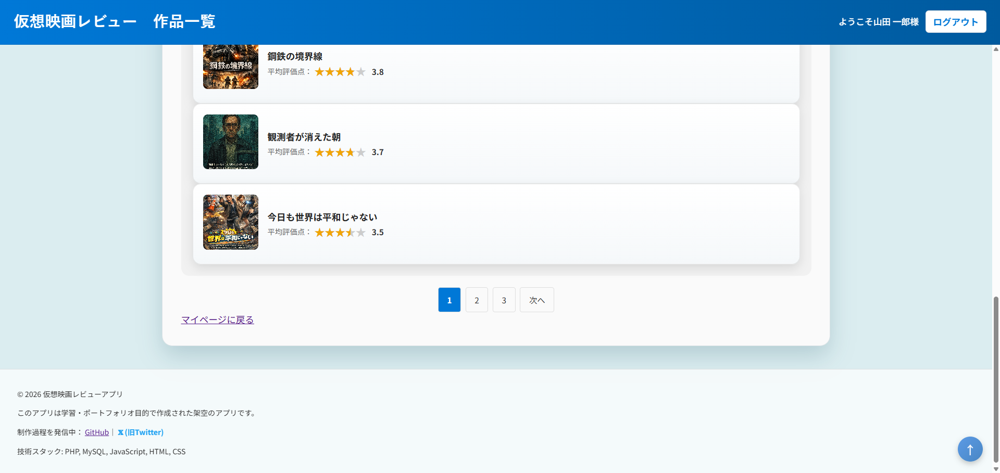
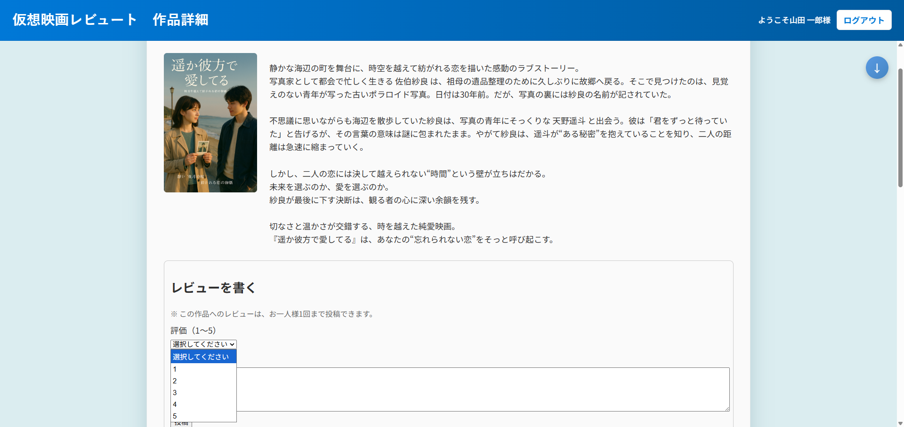
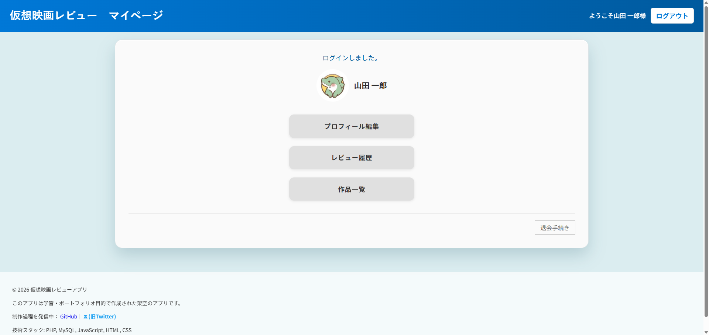

# Movie Review App

## 概要
映画のレビュー投稿アプリケーションです。
「観る前の判断材料」「観た後の共感」を提供することを目的としています。

職業訓練校の開発演習成果物をベースに、公開を想定してリファクタリングおよびセキュリティ対策を実施しました。

## 本番環境はこちら
https://portfolio.honda-dev.com/

## 使用技術
- PHP 7.4
- MariaDB / MySQL
- HTML / CSS
- JavaScript
- XServer（本番環境）

## 主な機能
- 会員登録 / ログイン機能
- レビュー投稿 / 編集 / 削除
- 評価（レーティング）機能
- ページネーション
- 管理機能

## 設計方針
- 環境ごとの設定分離（env.php）
- DB接続情報の非公開化（exampleファイル使用）
- ER図を考慮したリレーション設計
- 共通パーツ化による保守性向上

## セキュリティ対策
- CSRFトークン実装
- password_hash / password_verify 使用
- セッション固定攻撃対策
- 入力値バリデーション
- XSS対策（htmlspecialchars）
- 不正パラメータ検証

## 公開ポリシー
- 機密情報（env.php / database.php）は除外
- exampleファイルのみ公開
- 実運用を想定したログ管理とアクセス制御を実装

## 画面イメージ

### 作品一覧

### 作品詳細

### マイページ
